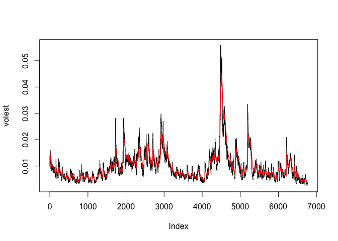

Week 11 Lecture Assignment
================
Lizzy Sterling
11/7/2017

Unit 11: Modeling Financial Data
================================

#### Description: This assignment is for educational purposes only. We are taking financial data and exploring it in order to figure out general trends and patterns of a time series. We are practicing using log returns to make these assumptions.

### S&P 500 (^GSPC)

#### SNP - SNP Real Time Price. Currency in USD

TODO: Download the data of SP500 '^gspc'.

``` r
SNPdata <- get.hist.quote('^gspc',quote="Close")
```

    ## 'getSymbols' currently uses auto.assign=TRUE by default, but will
    ## use auto.assign=FALSE in 0.5-0. You will still be able to use
    ## 'loadSymbols' to automatically load data. getOption("getSymbols.env")
    ## and getOption("getSymbols.auto.assign") will still be checked for
    ## alternate defaults.
    ## 
    ## This message is shown once per session and may be disabled by setting 
    ## options("getSymbols.warning4.0"=FALSE). See ?getSymbols for details.

    ## 
    ## WARNING: There have been significant changes to Yahoo Finance data.
    ## Please see the Warning section of '?getSymbols.yahoo' for details.
    ## 
    ## This message is shown once per session and may be disabled by setting
    ## options("getSymbols.yahoo.warning"=FALSE).

    ## time series ends   2017-11-03

TODO: Calculate the log returns, which is the subtraction of log(lag(SNPdata)) and log(SNPdata)

``` r
SNPret <- log(lag(SNPdata)) - log(SNPdata)
SNPret <- SNPret[!is.na(SNPret)] #getting rid of the NAs
```

TODO: Calculate volatility measure that is to multiply sd(SNPret),sqrt(250), 100

``` r
SNPvol <- sd(SNPret) * sqrt(250) * 100 
SNPvol
```

    ## [1] 17.63092

Define getVol function for volatility

``` r
getVol <- function(d, logrets) {
    var = 0
    lam = 0
    varlist <- c()

    for (r in logrets) {
        lam = lam*(1 - 1/d) + 1
      var = (1 - 1/lam)*var + (1/lam)*r^2
        varlist <- c(varlist, var)
    }

    sqrt(varlist)
}
```

Calculate volatility over entire length of series for various three different decay factors: 10 30. 100

``` r
volest <- getVol(10, SNPret)
volest2 <- getVol(30, SNPret)
volest3 <- getVol(100, SNPret)
```

Plot the results, overlaying the volatility curves on the data, just as was done in the S&P example.

``` r
plot(volest,type="l")

# TODO: Add connected line segments for volest2 with the parameters: type="l",col="red"
lines(volest2, type="l", col="red") 
```


